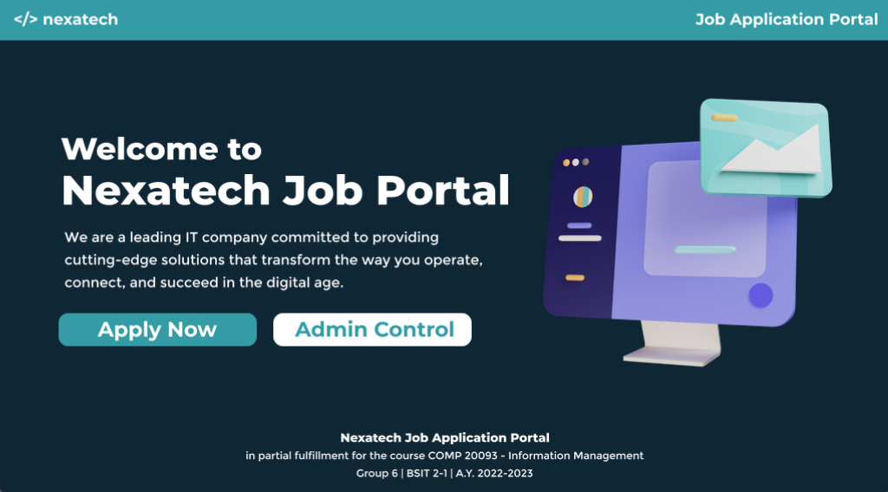

<br />
<div align="center">
  <a href="https://github.com/Rednaxela5/nexatech-job-application-portal">
    
  </a>

<p align="center">
  <h3 align="center">Nexatech Job Application Portal</h3>

  <p align="center">
    Apply with Ease, Manage with Control – Introducing Our Job Application Portal!
    <br/>
    <br/>
    <a href="https://github.com/Rednaxela5/nexatech-job-application-portal/blob/main/documents/Group6_InfoMan.docx"><strong>Explore the docs »</strong></a>
    <br/>
    <br/>
    <a href="https://youtu.be/3vmcn0OSdms">View Demo</a>
    .
    <a href="https://youtu.be/swB65igJ4C8">Installation Guide</a>
    .
    <a href="https://github.com/Rednaxela5/nexatech-job-application-portal/issues">Report Bug</a>
    .
    <a href="https://github.com/Rednaxela5/nexatech-job-application-portal/issues">Request Feature</a>
  </p>
  
</p>
<p align="center">
  
  
  
  
  
  
</p>
</div>


## Table Of Contents

* [About the Project](#about-the-project)
  * [Screenshots](#screenshots)
  * [Built With](#built-with)
* [Getting Started](#getting-started)
  * [Prerequisites](#prerequisites)
  * [Installation](#installation)
* [Usage](#usage)
* [Roadmap](#roadmap)
* [Contributing](#contributing)
* [License](#license)
* [Authors](#authors)
* [Acknowledgements](#acknowledgements)

# About The Project
Nexatech is a cool open source project that features job application form and administration control. The application was created as a project in our Database subject. The goal of this project is to showcase our knowledge in programming (especially in GUI) and database management using MySQL. 
<p align="right">(<a href="#top">back to top</a>)</p>

## Screenshots

Take a look at some screenshots showcasing the intuitive application form and powerful admin control of our Job Application Portal.

<table>
   <tr>
        <td>
            
            <br />
            <p align="center">Homepage</p></td>
        <td>
            
            <br />
            <p align="center">Personal Information</p></td>
    </tr>
    <tr>
        <td>
            
            <br />
            <p align="center">Desired Employment</p></td>
        <td>
            
            <br />
            <p align="center">Education</p></td>
    </tr>
    <tr>
        <td>
            
            <br />
            <p align="center">Work Experience</p></td>
        <td>
            
            <br />
            <p align="center">Major Skills</p></td>
    </tr>
    <tr>
        <td>
            
            <br />
            <p align="center">Ending Page</p></td>
        <td>
            
            <br />
            <p align="center">Login Page</p></td>
    </tr>
    <tr>
        <td>
            
            <br />
            <p align="center">Dashboard</p></td>
        <td>
            
            <br />
            <p align="center">New Applicant</p></td>
    </tr>
    <tr>
        <td>
            
            <br />
            <p align="center">View Applicants</p></td>
        <td>
            
            <br />
            <p align="center">Update Applicant</p></td>
    </tr>
    <tr>
        <td>
            
            <br />
            <p align="center">About Page</p></td>
        <td>
            
            <br />
            <p align="center">Confirm Logout</p></td>
    </tr>
      
</table> 

<p align="right">(<a href="#top">back to top</a>)</p>

## Built With

The following tools and techonologies were involved in the making of this project

* [Figma](https://www.figma.com/)
* [Python 🐍](https://www.python.org/)
* [Visual Studio Code](https://code.visualstudio.com/)
* [MySQL Server 🐬](https://www.mysql.com/products/workbench/)
* [MySQL Connector Python](https://dev.mysql.com/doc/connector-python/en/)
* [Tkinter Designer](https://github.com/ParthJadhav/Tkinter-Designer)

# Getting Started
If you're looking to set up a local copy that runs seamlessly, just follow these straightforward example steps.

## Prerequisites

- Python
- MySQL Workbench 8.0 CE
- Visual Studio Code

If all the above are satisfied, you may proceed to the next section.

## Installation
Follow these instructions to setup your own instance of the app. You can also follow the video tutorial [here](https://youtu.be/swB65igJ4C8).
### 1. Clone the repo
You may follow this instruction: [cloning a repository](https://docs.github.com/en/repositories/creating-and-managing-repositories/cloning-a-repository)

You may use github desktop for easy cloning.

```sh
gh repo clone Rednaxela5/nexatech-job-application-portal
``````

Or if you have git command line installed, clone using this command:
```sh
git clone https://github.com/Rednaxela5/nexatech-job-application-portal.git
```
### 2. Change the directory
Open terminal/cmd/powershell and change the directory to the cloned folder. You can also open the directory to your preferred IDE. 

```sh
cd Location\nexatech-job-application-portal
```

### 3. Install the necessary dependencies
```sh
pip install -r requirements.txt
```
In the event that pip doesn't work, you can also try the following commands:

`pip3 install -r requirements.txt`

`python -m pip install -r requirements.txt`

`python3 -m pip install -r requirements.txt`

### 4. Setup the database
Create the database from the MySQL schema:
1. Copy-paste the contents of [nexatech.sql](sql/nexatech.sql) directly into the MySQL command line, or simply open and run the MySQL file.
2. Verify the settings of each table in the schema.


### 5. Modify the config file
You need to modify the codes inside the config.py file before running the app.
1. Open [config.py](nexatech_app/config.py) and adjust these lines depending on your setup
```sh
USERNAME = "admin"
PASSWORD = "password"

MYSQL_HOST = 'localhost'
MYSQL_USER = 'root'
MYSQL_PASSWORD = 'P@ssw0rd2023!'
MYSQL_DATABASE = 'nexatech'
```

### 6. Install the fonts
This application used the "Montserrat" font. Install the fonts inside the [font](assets/font)

### 7. Run the app 🎉
Run the `application.bat` and you should see the home page window if there are no issues.

<p align="right">(<a href="#top">back to top</a>)</p>

# Roadmap

-   [x] ~~Improve the education page~~
-   [x] ~~Add error handler for each page in application from~~
-   [x] ~~Improve the database~~
-   [x] ~~Redesign the admin control (make it real)~~
-   [ ] Add and improve the add new applicant section (Admin Control)
-   [ ] Add more features in the Admin Control
-   [ ] Add graph and statistics in the Admin Control using matplotlib
<p align="right">(<a href="#top">back to top</a>)</p>

# Contribute

Contributions are what make the open source community such an amazing place to be learn, inspire, and create. Any contributions you make are **greatly appreciated**.
* If you have suggestions for adding or removing projects, feel free to [open an issue](https://github.com/Rednaxela5/nexatech-job-application-portal/issues/new) to discuss it, or directly create a pull request after you edit the *README.md* file with necessary changes.
* Please make sure you check your spelling and grammar.
* Create individual PR for each suggestion.
* Please also read through the [Code Of Conduct](https://github.com/Rednaxela5/nexatech-job-application-portal/blob/main/CODE_OF_CONDUCT.md) before posting your first idea as well.

## Creating A Pull Request

1. Fork the Project
2. Create your Feature Branch (`git checkout -b feature/AmazingFeature`)
3. Clone and checkout that branch locally.
4. Commit your Changes (`git commit -m 'Add some AmazingFeature'`)
5. Push to the Branch (`git push origin feature/AmazingFeature`)
6. Open a Pull Request

<p align="right">(<a href="#top">back to top</a>)</p>


# License

Distributed under the MIT License. See [LICENSE](https://github.com/Rednaxela5/nexatech-job-application-portal/blob/main/LICENSE) for more information.

# Authors

* **Alexander Porlares** - [@Rednaxela5](https://github.com/Rednaxela5) - Head/Back End
* **Jallane Roncales** - [Jallane Roncales]() - Front End
* **Jerome Agarin** - [Jerome Agarin](none) - Front End
* **Luen Lozada** - [@lnlzd](https://github.com/lnlzd) - Back End

# Acknowledgements

* [Parth Jadhav](https://github.com/ParthJadhav) and his [contributors](https://github.com/ParthJadhav/Tkinter-Designer/graphs/contributors) for their awesome [Tkinter-Designer](https://github.com/ParthJadhav/Tkinter-Designer). This project would look dull if we used the common tkinter. So thank you very much for this helpful project.
* [Mohit Yadav](https://github.com/Just-Moh-it) for his [HotinGo](https://github.com/Just-Moh-it/HotinGo) project. Learned a lot from his approach in making README.md as well as the whole project.
* [raja2505](https://github.com/raja2505) for his [Name Patcher](https://github.com/ParthJadhav/Tkinter-Designer/issues/345). Made renaming elements and editing code a lot faster.

<p align="right">(<a href="#top">back to top</a>)</p>

